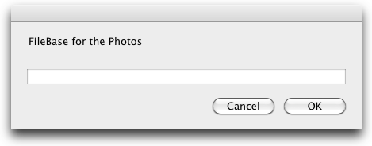

# BatchRename 1.0
by Pedro Parracho <pedro.parracho@gmail.com>

## Description:
Rename files script for mac OS X. It will take a bunch of files and will change their name according with the scheme:
`aaaa.mm.dd.fileBase.sequence.extension`
The date field is created using the file creation time, the filename is a text string requested by the script via dialog window, sequence a is a sequential number generated. 
## Install
To install you need to copy the workflow to the folder `~/Library/Services`.

## Feature

It will rename the selected files according with the scheme: `aaaa.mm.dd.fileBase.sequence.extension`

## Screenshot

## License

Released under MIT License